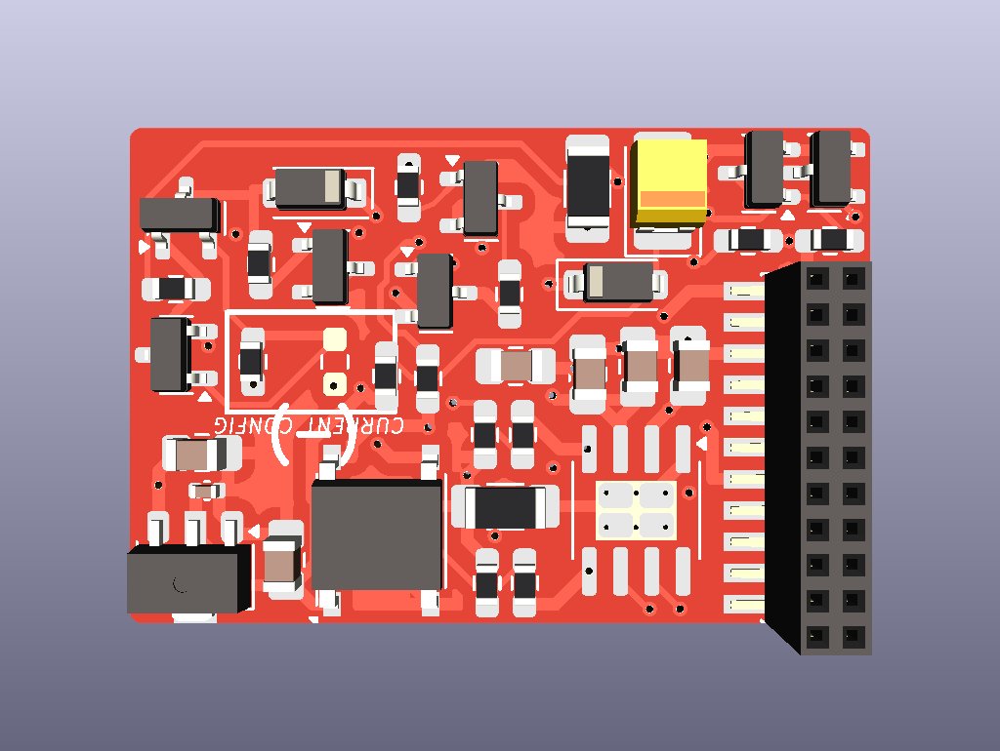
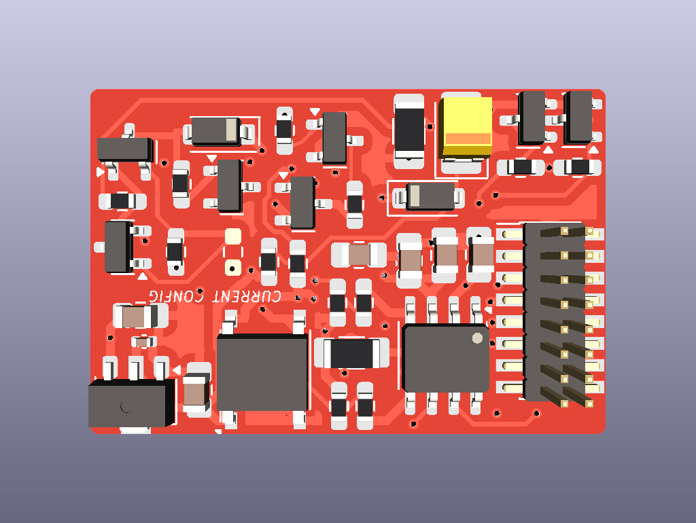
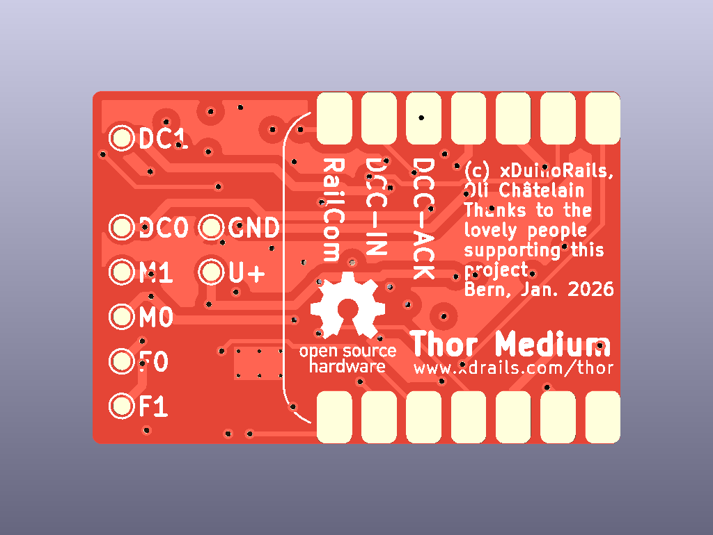

# mtc21/plux16 Semi-Decoder for Seeed XIAO boards

Make a Seeed XIAO board a mtc21 decoder, all the electronics needed is on this little board:
- mtc21 connector (but not the size)
- DC Motor
- 2x Functions
- DCC / DCC-ACK / RailCom

Open-Source [schematics](xDuinoRails-Thor-M-schematic.pdf) and [PCB design](xDuinoRails-Thor-M-PCB_All.pdf) included.




## Wiring

```
                     +--------------------+      +--------------------+         +---------------+
                     |      RP2040        |      |     BDR-6133       |         |     Motor     |
                     |    (Top View)      |      |    Motor Driver    |         | DC brushed    |
                     +--------------------+      +--------------------+         +---------------+
                     |                5v  |      |                    |         |               |
          ---``|<----| D15 (LED)      GND |      |                    |         |               |
          ---``|<----| D16 (LED)      3v3 |      |                    |         |               |
                     |                    |      |                    |         |               |
                     |        (PWM B) D8  |----->| InB           OutB |=====+==>| B             |
                     |        (PWM A) D7  |----->| InA           OutA |==+==|==>| A             |
                     |                    |      +---------+----------+  |  |   +---------------+
                     |       (Shut)   A2  |<.............../             |  |
                     |       (bEMF B) A1  |<----------------------------/   |
                     |       (bEMF A) A0  |<-------------------------------/
                     |                    |
                     |                    |      +--------------------+
                     |                    |      | Functions          |
                     |                    |      +--------------------+
                     |         F0f    D9  |----->| F0f                |
                     |         F0b    D10 |----->| F0b                |
                     |                    |      +---------+----------+
                     |       (Shut)   A3  |<.............../

                     |                    |      +--------------------+
                     |                    |      | DCC / Railcom      |
                     |                    |      +--------------------+
                     |     DCC-ACK    D4  |----->| DCC-ACK            |
                     |     DCC/MM/SX  D5  |<-----| DCC/MM/SX          |
                     |     RailCom    D6  |----->| RailCom            |
                     |                    |      +---------+----------+
                     |       (Shut)   A3  |<.............../
                     +--------------------+
```

## Purchase your copy

If you want an easy way to try this board, order one on tindie:
- https://www.tindie.com/products/chatelao/diy-dccmm-decoder-for-xiao-boards
